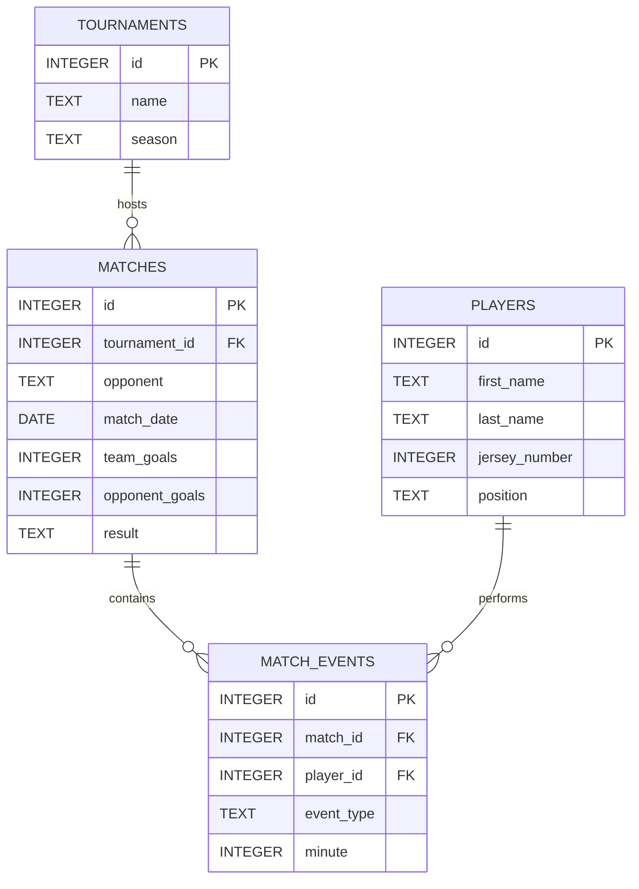

# Design Document

By Ali Sabry Ibraheem Ali

Video overview: (https://youtu.be/gfwMQ2uhY_k)

## Scope

The purpose of this database is to track and analyze the football matches, player statistics, and match events for Al Ahly SC. It is designed to allow coaching staff, analysts, or fans to store match results, log in-game events like goals and cards, and easily retrieve performance metrics over different tournaments.

The database scope includes:
* **Players:** Basic information including their jersey numbers and roles on the pitch.
* **Tournaments:** The competitions the team participates in, categorized by season.
* **Matches:** Details about individual games, the opponent, dates, and final outcomes.
* **Match Events:** A granular log of specific in-game occurrences (Goals, Assists, Cards) associated with the minute they happened and the player involved.

Out of scope are elements like player contracts, salaries, or ticketing data, as the core focus is purely on sporting performance.

## Entities

The database consists of four core tables:

1. players:
   * Stores the team roster.
   * Uses TEXT with a CHECK constraint for positions to restrict invalid data entries, acting like an ENUM.

2. tournaments:
   * Stores competition names.
   * Includes a season column to differentiate between versions of the same tournament (e.g., Egyptian Premier League 23/24).

3. matches:
   * Stores game results.
   * Connects to tournaments via a foreign key.
   * Uses a CHECK constraint for the match result (Win, Draw, Loss).

4. match_events:
   * A junction-like table linking a match and a player to an action.
   * Includes a CHECK constraint ensuring the minute is <= 120 (regular time + extra time).

## Relationships

Below is the Entity Relationship Diagram for the database:

* A tournament can host zero or many matches (1-to-many).
* A match can contain zero or many match_events (1-to-many).
* A player can be associated with zero or many match_events (1-to-many).

## Optimizations

* **Views:** A top_scorers view was created to encapsulate a complex JOIN and aggregation logic. This allows users to quickly query the highest goalscorers without writing the full underlying logic repeatedly.
* **Indexes:** An index idx_match_date was placed on matches(match_date). Since analysts frequently query matches played in a specific month or year, this index transforms sequential scans into significantly faster tree lookups.
* **Data Types:** Utilizing CHECK constraints ensures data integrity within SQLite's flexible typing system, preventing rogue data entries for strict categories like positions and match events.
